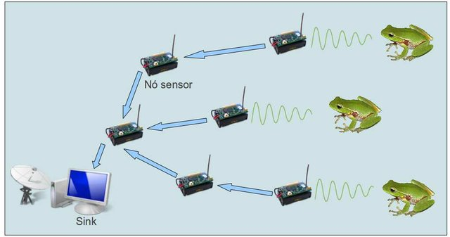

## Redes de Sensores Sem Fio
Repositório de rotinas da disciplina de Redes de Sensores Sem Fio da Pós-Graduação em Prédios Inteligentes

Aimagem a seguir ilustra a Rede de Sensores Sem Fio utilizada no projeto de Classificação de Anuros Baseado em Vocalizações para Monitoramento Ambiental Pervasivo. Conheça o projeto [aqui](https://www.researchgate.net/publication/256473761_Classificacao_de_Anuros_Baseado_em_Vocalizacoes_para_Monitoramento_Ambiental_Pervasivo/figures?lo=1)

Esse [link](http://esp32.net/) apresenta vários repositórios sobre o ESP32. Um referencial interessante para quem está começando a estudar o assunto.

O protocolo MQTT é utilizado para estabelecer comunicação entre equipamentos e usuários. Para tanto, vejam detalhes do protocolo [aqui](https://www.ibm.com/developerworks/br/library/iot-mqtt-why-good-for-iot/index.html) 

